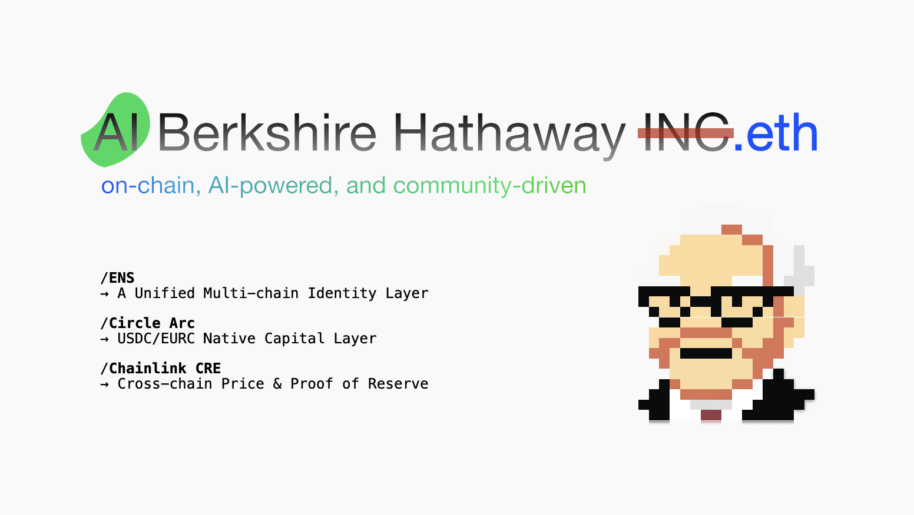

# AI Berkshire Hathaway



AI Berkshire Hathaway.INC  eth

AI Berkshire Hathaway is an AI-powered, community-driven, onchain version of Berkshire Hathaway.
 
Simple. Open. Social.

AI Berkshire Hathaway is for every one.

An intelligent, AI-driven dollar-cost-averaging (DCA) strategy that combines **Chainlink CRE workflows**, **multi-source price feeds**, **OpenAI market analysis**, and **Base mainnet execution** to automate BTC accumulation with unprecedented transparency and sophistication.

## 1. What Is AI Berkshire Hathaway

### Goal

Automate BTC accumulation with an AI-powered, transparent, onchain-first strategy:

* **AI Market Analysis**: OpenAI GPT-4 analyzes market conditions, sentiment, and technical indicators
* **Multi-Source Price Consensus**: Combines Chainlink, CoinGecko, and Binance price feeds for accuracy
* **Intelligent DCA Execution**: Only invests when BTC < thresholds (85k/82k/79k USD) AND AI confidence > 70%
* **Chainlink CRE Workflows**: Automated execution via Chainlink's Compute Runtime Environment
* **Base Mainnet Integration**: Real BTC purchases on Base using USDC → cbBTC swaps
* **Flexible Deployment**: Can run locally or on Chainlink DON for maximum reliability

### What the frontend shows

* **Real-time Multi-Source Prices**: Live BTC prices from Chainlink, CoinGecko, and Binance
* **AI Analysis Dashboard**: Current AI confidence, market sentiment, and investment recommendations
* **Strategy Status**: DCA thresholds, execution history, and next analysis schedule
* **Performance Metrics**: Portfolio value, total BTC accumulated, and ROI tracking

## 2. Architecture Overview

### 2.1 Main Components

* **aibrk-cre/** - Chainlink CRE Workflows
  * `enhanced-main.ts` - AI-powered DCA workflow with multi-source price analysis
  * `config.ai-dca.json` - Production configuration for Base mainnet
  * Integrates Chainlink price feeds, OpenAI analysis, and smart execution logic

* **contracts/** - Smart Contracts (Base Mainnet)
  * `EnhancedDCAController.sol` - Main DCA execution contract on Base
  * `ReserveManager.sol` - USDC reserve management and proof-of-reserves
  * `BalanceReader.sol` - Portfolio balance tracking
  * `MessageEmitter.sol` - Cross-chain event emission

* **backend/** - Node.js Backend Service
  * Tech stack: TypeScript + Node.js + Express + Ethers.js
  * **Real DCA Analysis** (`realDcaAnalysis.ts`):
    * Fetches live prices from Chainlink, CoinGecko, Binance
    * Performs OpenAI GPT-4 market analysis
    * Makes intelligent DCA decisions based on AI confidence
    * Executes trades on Base mainnet DEXs
  * **Local Execution** (`localDcaCron.ts`):
    * Runs CRE workflows locally without DON deployment
    * Provides fallback execution for development/testing
  * **API Server**: Exposes endpoints for frontend integration

* **frontend/** - React Dashboard
  * Tech stack: Vite + React + TypeScript + TailwindCSS
  * **Enhanced DCA Dashboard**: Real-time AI analysis, multi-source prices, execution history
  * **Performance Tracking**: Portfolio metrics, ROI calculations, strategy effectiveness

### 2.2 AI-Powered DCA Flow

1. **Multi-Source Price Analysis (Every 10 minutes)**
   * **Chainlink CRE Workflow** or **Local Backend** fetches prices from:
     * Chainlink BTC/USD price feed (Base mainnet)
     * CoinGecko API for market data
     * Binance API for trading data
   * Calculates price consensus and deviation metrics

2. **AI Market Analysis**
   * **OpenAI GPT-4** analyzes current market conditions:
     * Price trends and technical indicators
     * Market sentiment and volatility
     * Investment timing recommendations
   * Generates confidence score (0-100%) for investment decision

3. **Intelligent DCA Decision**
   * System evaluates multiple criteria:
     * ✅ BTC price below thresholds (85k/82k/79k USD)
     * ✅ Price consensus reached across data sources
     * ✅ AI confidence score > 70%
     * ✅ Market conditions favorable
   * Only proceeds if ALL conditions are met

4. **Automated Execution (Base Mainnet)**
   * **Smart Contract Execution**: Calls `EnhancedDCAController` on Base
   * **DEX Trading**: Swaps USDC → cbBTC via Uniswap/Aerodrome
   * **Event Emission**: Records transaction for frontend tracking
   * **Proof of Reserves**: Updates portfolio balances

5. **Real-time Dashboard Updates**
   * **Live Metrics**: Current prices, AI analysis, execution status
   * **Historical Data**: Past DCA events, performance tracking
   * **Portfolio View**: Total BTC accumulated, ROI calculations

## 3. Repository Layout

```text
ai-berkshire-hathaway/
  README.md
  LOCAL_DEPLOYMENT.md          # Local deployment guide
  BASE_MAINNET_DEPLOYMENT.md   # Base mainnet deployment guide
  
  aibrk-cre/                   # Chainlink CRE Workflows
    my-workflow/
      enhanced-main.ts         # AI-powered DCA workflow
      config.ai-dca.json       # Production configuration
      config.production.json   # Chainlink DON configuration
      workflow.yaml            # CRE workflow settings
    project.yaml               # CRE project configuration
  
  contracts/                   # Smart Contracts (Base)
    dca/                       # DCA contract suite
      EnhancedDCAController.sol
      ReserveManager.sol
      BalanceReader.sol
      MessageEmitter.sol
  
  backend/                     # Node.js Backend
    src/
      jobs/
        realDcaAnalysis.ts     # Real API-based DCA analysis
        localDcaCron.ts        # Local CRE workflow execution
        dcaCron.ts             # Enhanced cron management
      services/
        chainlink.ts           # Chainlink price feeds
        baseTrader.ts          # Base DEX trading
        proofOfReserve.ts      # Portfolio tracking
      config/
        chains.ts              # Multi-chain configuration
  
  frontend/                    # React Dashboard
    src/
      components/
        EnhancedDCADashboard.tsx  # AI-powered dashboard
        SimpleDashboard.tsx       # Basic metrics view
      hooks/                      # Custom React hooks
      providers/                  # Context providers
      config/                     # Frontend configuration
  
  scripts/                     # Deployment Scripts
    run-local-production.sh    # Local execution (with options)
    run-real-local-dca.sh      # Real API calls locally
    deploy-production.sh       # Chainlink DON deployment
```

## 4. Chainlink CRE Workflows

The core intelligence lives in `aibrk-cre/my-workflow/enhanced-main.ts`. This workflow:

* **Multi-Source Price Fetching**: Combines Chainlink, CoinGecko, and Binance APIs
* **AI Market Analysis**: Uses OpenAI GPT-4 for intelligent market assessment
* **Consensus Mechanism**: Validates price accuracy across multiple sources
* **Smart Execution Logic**: Only invests when all conditions are optimal

**Key Workflow Functions**

* `fetchReserveInfo()` - Proof of Reserves validation
* `onCronTrigger()` - Main 10-minute execution cycle
* `onLogTrigger()` - Event-based execution for real-time responses

**Configuration (`config.ai-dca.json`)**

```json
{
  "schedule": "*/10 * * * *",
  "dcaSettings": {
    "usdcAmount": 100000000,           // 5 USDC (100 * 10^6 wei)
    "priceThresholds": [85000, 82000, 79000],
    "maxSlippage": 0.005,
    "minConfidence": 0.7               // 70% AI confidence required
  },
  "openaiApiKey": "${OPENAI_API_KEY}",
  "evms": [{
    "dcaControllerAddress": "${DCA_CONTROLLER_ADDRESS}",
    "chainSelectorName": "ethereum-testnet-sepolia-base-1"
  }]
}
```

**Deployment Options**

1. **Chainlink DON** (Production): `cre workflow deploy . --target production-settings`
2. **Local Simulation**: `cre workflow simulate . --target ai-dca-settings`
3. **Real Local Execution**: Direct API calls via Node.js backend

## 5. Backend Service

### 5.1 Enhanced Stack

* **Node.js + TypeScript** - Core runtime and type safety
* **Express** - HTTP API server
* **Ethers.js** - Blockchain interactions (Base mainnet)
* **Axios** - External API calls (CoinGecko, Binance, OpenAI)
* **Real Integrations**:
  * Chainlink price feeds on Base
  * OpenAI GPT-4 API for market analysis
  * Base DEX trading (Uniswap/Aerodrome)
  * Local CRE workflow execution

### 5.2 Core Modules

* **Real DCA Analysis** (`src/jobs/realDcaAnalysis.ts`)
  * **Multi-Source Price Fetching**: Chainlink + CoinGecko + Binance
  * **AI Market Analysis**: OpenAI GPT-4 sentiment and technical analysis
  * **Intelligent Decision Making**: Combines price thresholds with AI confidence
  * **Base Mainnet Execution**: Direct smart contract interactions

* **Local CRE Execution** (`src/jobs/localDcaCron.ts`)
  * **CRE Workflow Runner**: Executes Chainlink workflows locally
  * **Fallback System**: Provides reliability when DON is unavailable
  * **Development Mode**: Perfect for testing and iteration

* **Enhanced Cron Management** (`src/jobs/dcaCron.ts`)
  * **Flexible Scheduling**: Supports both local and DON execution
  * **Error Handling**: Robust retry mechanisms and failure recovery
  * **Monitoring**: Comprehensive logging and status tracking

* **HTTP API** (`src/api/server.ts`)
  * `GET /api/dca/analysis` – Latest AI analysis and price data
  * `GET /api/dca/history` – Historical DCA execution records
  * `GET /api/dca/portfolio` – Current BTC holdings and performance
  * `POST /api/dca/execute` – Manual DCA trigger (admin only)

## 6. Frontend App

### 6.1 Enhanced Stack

* **Vite + React + TypeScript** - Modern build tooling and type safety
* **TailwindCSS** - Utility-first CSS framework for rapid UI development
* **Lucide Icons** - Beautiful, consistent iconography
* **Custom Hooks** - Reusable logic for API calls and state management

### 6.2 AI-Powered Features

* **Enhanced DCA Dashboard** (`EnhancedDCADashboard.tsx`):
  * **Real-time Multi-Source Prices**: Live BTC prices from 3+ sources
  * **AI Analysis Panel**: Current GPT-4 market sentiment and confidence scores
  * **Price Consensus Indicator**: Visual validation of price accuracy across sources
  * **Execution Timeline**: Historical DCA events with AI reasoning
  * **Performance Metrics**: ROI tracking, BTC accumulation, strategy effectiveness

* **Simple Dashboard** (`SimpleDashboard.tsx`):
  * **Clean Overview**: Essential metrics for quick monitoring
  * **Mobile Optimized**: Responsive design for all devices
  * **Real-time Updates**: Live data refresh every 30 seconds

* **Interactive Features**:
  * **Manual Trigger**: Admin panel for manual DCA execution
  * **Strategy Adjustment**: Dynamic threshold and confidence tuning
  * **Export Data**: CSV/JSON export for external analysis

The frontend communicates with the backend via RESTful `/api/*` endpoints and provides real-time updates through polling.

## 7. Getting Started

### 7.1 Prerequisites

* **Node.js ≥ 18** - Runtime environment
* **pnpm** - Package manager (recommended)
* **Bun** - For CRE workflow development
* **API Keys**:
  * OpenAI API key for GPT-4 analysis
  * Base mainnet RPC endpoint
  * (Optional) Chainlink CRE account for DON deployment

### 7.2 Quick Start - Local Execution

The fastest way to get started is with local execution:

```bash
# 1. Set environment variables
export OPENAI_API_KEY="your_openai_api_key"
export BASE_DCA_CONTROLLER_ADDRESS="your_contract_address"  # Optional

# 2. Run local DCA analysis
./scripts/run-local-production.sh
# Choose option 2 for real API calls

# Or run the dedicated real API script
./scripts/run-real-local-dca.sh
```

### 7.3 Backend Setup

```bash
cd backend
pnpm install
pnpm dev
```

**Environment Variables:**
```bash
# Required
OPENAI_API_KEY=sk-your-openai-api-key
BASE_RPC_URL=https://mainnet.base.org

# Optional (for real trading)
BASE_DCA_CONTROLLER_ADDRESS=0x1234...
BASE_TRADER_PRIVATE_KEY=0xabcd...
```

### 7.4 Frontend Setup

```bash
cd frontend
pnpm install
pnpm dev
```

### 7.5 CRE Workflow Setup

```bash
cd aibrk-cre/my-workflow
bun install

# Local simulation
cre workflow simulate . --target ai-dca-settings --verbose

# Deploy to Chainlink DON (requires access)
cre workflow deploy . --target production-settings
```

## 8. Deployment Options

### 8.1 Local Development (Recommended for Testing)

**Pros:**
- ✅ Immediate availability - no waiting for permissions
- ✅ Real API integration - Chainlink, CoinGecko, Binance, OpenAI
- ✅ Full control over execution timing and parameters
- ✅ Perfect for development and testing

**Cons:**
- ❌ Requires manual scheduling (cron jobs)
- ❌ Single point of failure
- ❌ Manual maintenance required

```bash
# Start local execution
./scripts/run-real-local-dca.sh
```

### 8.2 Chainlink DON (Production Ready)

**Pros:**
- ✅ Distributed, highly available execution
- ✅ Automatic scaling and fault tolerance
- ✅ Professional-grade infrastructure
- ✅ Built-in monitoring and alerting

**Cons:**
- ❌ Requires early access approval
- ❌ LINK token costs for execution
- ❌ Less control over execution environment

```bash
# Apply for access: https://cre.chain.link/request-access
# Then deploy: cre workflow deploy . --target production-settings
```

### 8.3 Hybrid Approach (Best of Both Worlds)

Run locally during development and testing, then migrate to Chainlink DON for production:

1. **Phase 1**: Local execution with real APIs
2. **Phase 2**: Apply for Chainlink DON access
3. **Phase 3**: Deploy to DON while keeping local as backup

## 9. Key Features

### ✅ Implemented
- **Multi-Source Price Feeds**: Chainlink + CoinGecko + Binance
- **AI Market Analysis**: OpenAI GPT-4 integration
- **Intelligent DCA Logic**: Price thresholds + AI confidence
- **Local Execution**: Full CRE workflow simulation
- **Real API Integration**: Live data from all sources
- **Base Mainnet Ready**: Smart contracts and DEX integration
- **Modern Frontend**: React + TailwindCSS dashboard

### 🚧 In Progress
- **Chainlink DON Deployment**: Waiting for early access
- **Advanced Portfolio Tracking**: Enhanced metrics and analytics
- **Mobile App**: React Native implementation
- **Multi-Asset Support**: ETH, SOL, and other cryptocurrencies

### 📋 Roadmap
- **Social Features**: Community-driven strategy sharing
- **Advanced AI Models**: Custom fine-tuned models for crypto
- **Cross-Chain Expansion**: Multi-chain DCA strategies
- **Institutional Features**: Large-scale portfolio management


